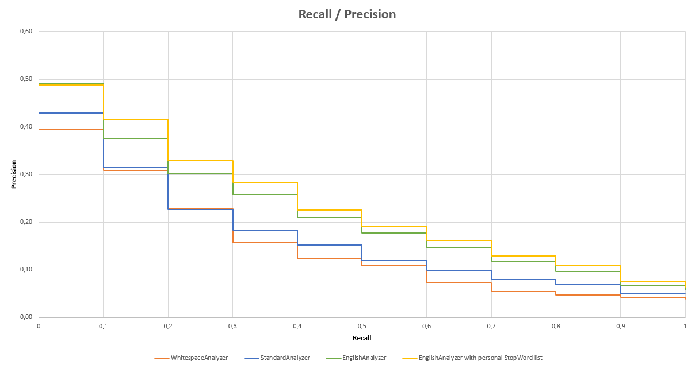

# T-InfData Labo2
* Romain Capocasale
* Selajdin Bilali
* 14.10.2020
* HES-SO MASTER

## Precision vs Recall graph

## Conclusion
On constate dans que les meilleurs anlayseurs dans l'ordre du meilleur au moins bon sont :
1. EnglishAnalyzer avec la liste de stop word personnelle
2. EnglishAnalyzer
3. StandardAnalyzer
4. WhitespaceAnalyzer

Dans notre cas, il est important d'avoir un bon compromis entre la précision et le rappel car d'un coté on veut une bonne précision pour que le plus de document correcte sois récupéré mais sans récupéré tout les documents de la collection non plus. Pour le rappel, on veut que le maximum de documents pertients possible sois récupéré. 

L'English Analyzer avec la liste de stop word personnelle est l'analyseur qui satisfait le mieux les critères cités ci-dessus. Cet analyseur a la plus grande aire sous la courbe. Ceci signifie qu'il maximise la précision et le rappel.
